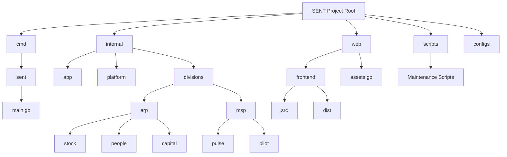

# Project Structure Map

## Directory Description

- **cmd/sent**: Entry point for the application. Contains `main.go`.
- **internal**: Private application code.
    - **app**: Application-specific logic (e.g., Wails bridge).
    - **platform**: Shared infrastructure (Auth, Database, Orchestrator).
    - **divisions**: Domain logic split into ERP and MSP.
- **web**: Web assets and embedding logic.
    - **frontend**: The Vite/React frontend application.
    - **assets.go**: Go file embedding the `dist` folder.

- **scripts**: Utility and maintenance scripts (`*.ps1`, `*.go`).
