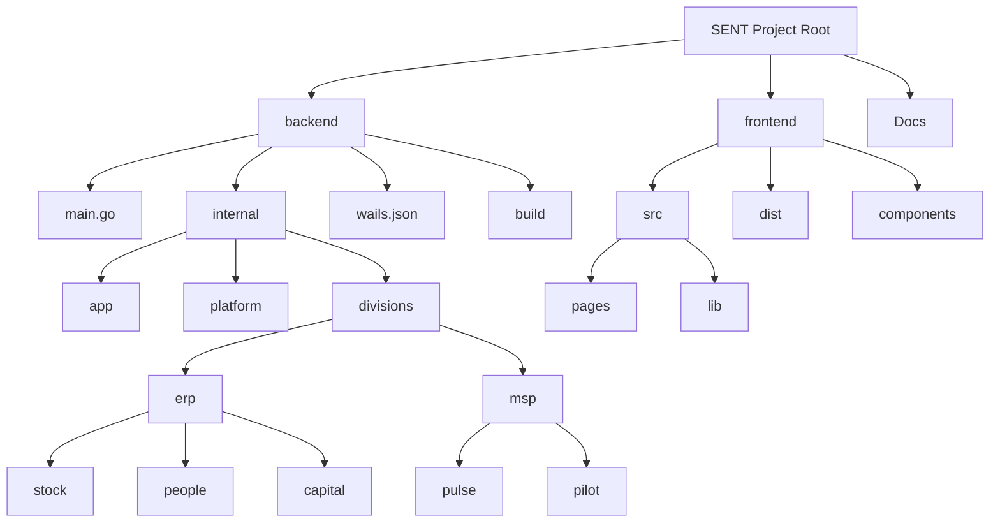

# Project Structure Map

## Directory Description

- **backend/**: The Go application code (Wails).
    - **main.go**: Entry point for the application.
    - **internal/**: Private application code.
        - **app/**: Application-specific logic (e.g., Wails bridge).
        - **platform/**: Shared infrastructure (Auth, Database, Orchestrator).
        - **divisions/**: Domain logic split into ERP and MSP.
    - **wails.json**: Wails project configuration.

- **frontend/**: The Vite/React frontend application.
    - **src/**: Source code.
        - **pages/**: Route components.
        - **lib/**: Shared utilities.
    - **wailsjs/**: Generated Go bindings for TypeScript.

- **Docs/**: Project documentation.
