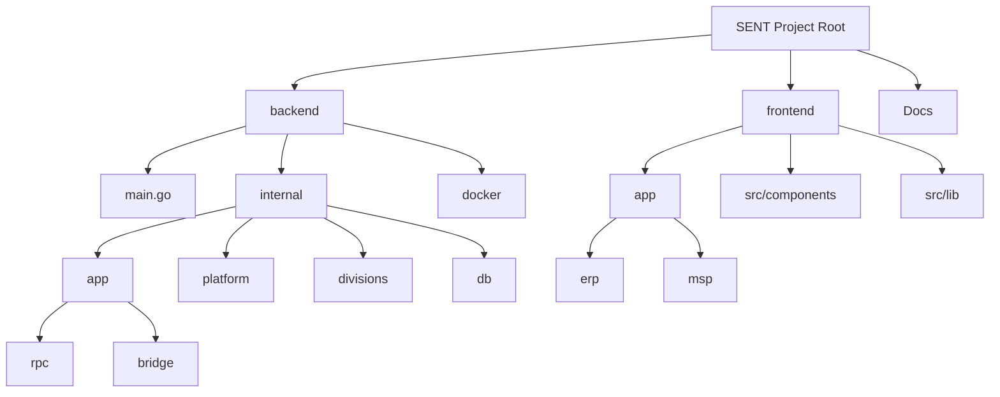

# Project Structure Map (Web Edition)

## Directory Description

- **backend/**: Pure Go API Server.
    - **internal/**:
        - **app/bridge/**: Domain bridges (Logic Layer).
        - **app/rpc/**: Universal JSON-RPC Dispatcher.
        - **divisions/**: ERP/MSP/SEC domain logic.
        - **db/**: Generated SQLc code.

- **frontend/**: Next.js 15 Application.
    - **src/app/**: App Router routes and pages.
    - **src/components/**: ShadCN/UI components.
    - **src/lib/**: Shared utilities and API client.

- **Docs/**: Project documentation.
