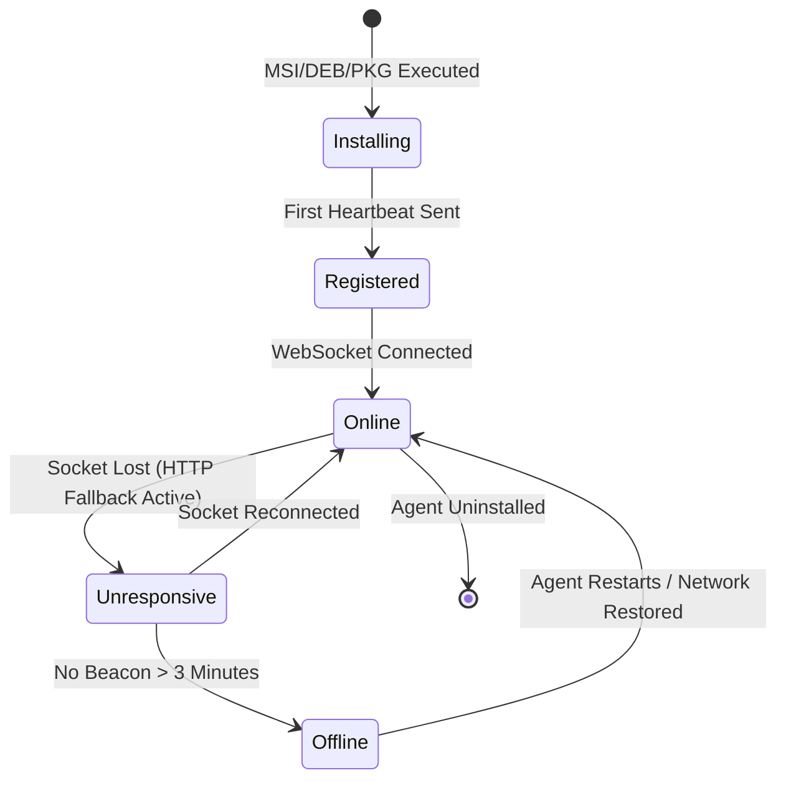

# **SENTpulse – Remote Monitoring & Management (RMM)**

**Division:** SENTmsp (Infrastructure)  
**Status:** [PLANNING]

## **1. Executive Summary**

SENTpulse is the heartbeat of the SENTmsp division. It is a high-performance, low-latency Remote Monitoring and Management (RMM) platform designed to provide real-time visibility into the health and performance of servers, workstations, and network devices. Unlike traditional RMMs that rely on heavy Java or .NET agents, SENTpulse utilizes a lightweight, native Go binary that runs silently in the background with minimal resource overhead.

## **2. Technical Architecture**

### **2.1 The Agent (The Pulse)**

- **Language:** Go (Golang) 1.24+
- **Deployment:** Native binary service (Systemd on Linux, Windows Service on Windows, LaunchDaemon on macOS).
- **Footprint:** <1% CPU usage, <20MB RAM idle.
- **Communication:** Secure WebSocket (WSS) connection to the SENTcore central server + HTTPs (Secondary) for file transfer and remote access. WSS for "Live Mode" (when a tech is looking at the screen) and simple HTTPs posts for the background heartbeat (every 60s) to save server resources.
- **Telemetry Library:** `go-sysinfo` for hardware abstraction.

### **2.2 The Backend (The Heart)**

- **Ingestion:** TimescaleDB (PostgreSQL Extension) for high-velocity metrics (CPU, RAM, Network I/O).
- **Processing:** Real-time stream processing for alert triggering (e.g., "CPU > 90% for 5 mins").

### **2.3 The Frontend (The Monitor)**

- **Framework:** NextJS
- **Visualization:** Real-time graphs using `ShadCN` UI components for high-density time-series data.

## **3. Core Features**

### **3.1 Real-Time Telemetry**

- **Hardware Monitoring:** Live streaming of CPU temperature, fan speeds, voltage, disk S.M.A.R.T status, and RAM utilization.
- **Process Management:** Live task manager allowing the technician to kill runaway processes remotely without RDP.
- **Service Control:** Start, stop, and restart system services (Windows Services / Systemd units).
- **Antivirus Manager:** Real-time status reporting of Anti-virus software (e.g., Windows Defender) ensuring definitions are up-to-date and protection is active.

### **3.2 Automated Self-Healing (Automation Engine)**

- **Script Repository:** Centralized library (`ScriptRepository.tsx`) for managing PowerShell (.ps1) and Bash (.sh) scripts.
- **Job Scheduler:** `JobScheduler` component allows technicians to schedule scripts to run once or on a recurring Cron schedule (e.g., "Daily Cleanups at 3 AM").
- **Execution History:** Full audit log of script runs, output (stdout/stderr), and exit codes.
- **Scenarios:**
  - _Scenario:_ Print Spooler service crashes. -> _Action:_ Restart Service.
  - _Scenario:_ Disk space < 5%. -> _Action:_ Run cleanup script and clear temp folders.

### **3.3 Patch Management**

- **Windows Updates:** Native integration with Windows Update Agent (WUA) via COM interface (`patches_windows.go`).
- **Linux Updates:** Wrapper for `apt`, `dnf`, and `yum` package managers (`patches_linux.go`).
- **Patch Dashboard:** `PatchesTab` provides a unified view of missing updates (Critical, Security, Feature) with one-click install capability.
- **Third-Party Patching:** Integration with `winget` and `chocolatey` for keeping applications like Chrome, Zoom, and Adobe Reader up to date.

### **3.4 Remote Access**

- **Graphical Remote Desktop:** Powered by a self-hosted RustDesk infrastructure to ensure data sovereignty and maximum performance. The SENTpulse agent automatically deploys and configures the RustDesk service on endpoints, peering them directly with the private SENTmsp ID/Relay servers (hbbs/hbbr). Sessions are initiated via a custom URI scheme (rustdesk://), launching a native, high-fidelity connection on the technician’s machine without manual authentication.
- **Terminal:** Fully interactive web-based terminal (`TerminalComponent.tsx`) using `xterm.js` and a custom Go PTY backend (`terminal.go`). Supports resize events, ANSI colors, and allows for "stealth" command line management without interrupting the end-user's graphical session.
- **File Browser:** dedicated remote file system explorer allowing technicians to navigate directories, upload scripts, and download logs in the background, independent of the desktop session.

### **3.5 Network Monitoring (SNMP)**

- **Device Discovery:** Polls and monitors network devices (Switches, Firewalls, Printers) unrelated to the agent host.
- **Metrics:** Tracks Bandwidth (In/Out), Interface Status, and Device Uptime via SNMPv2c/v3.
- **Alerting:** Triggers alerts on specific OID values (e.g., "Printer Toner Low", "Switch Port Error Rate High").

### **3.6 System Power Actions**

- **Reboot:** One-click device restart directly from the dashboard.
- **Shutdown:** Graceful OS shutdown for maintenance windows.

### **3.7 Event Log Viewer**

- **Windows:** Pulls Error/Warning logs from the System Event Log using PowerShell.
- **Linux:** Fetches logs from `journalctl` with priority filter (Error/Warning).
- **Display:** Shows Timestamp, Level (color-coded), Source, and Message in a searchable table.

### **3.8 Environment Variables**

- **Full Listing:** Displays all system environment variables on the remote device.
- **Search/Filter:** Filter by key or value for quick troubleshooting.

### **3.9 Availability & Heartbeat Logic**

- **Pulse Mechanism:** The agent maintains a persistent WebSocket connection ("The Pulse") for real-time status. If the socket is severed, the agent falls back to a lightweight HTTP/2 heartbeat beacon every 60 seconds to minimize bandwidth while retaining connectivity state.
- **State Logic:** Devices are classified into three states based on telemetry receipt:
  - **Online (Green):** WebSocket is active; telemetry < 30s old.
  - **Unresponsive (Amber):** WebSocket dropped, but HTTP beacon received within the last 5 minutes. (Likely unstable network).
  - **Offline (Red):** No beacons received for > 3 consecutive intervals (3 minutes). Triggers "Device Down" alert immediately.
- **Wake-on-LAN Proxy:** Offline devices can be targeted for a "Wake" command. The SENTcore server instructs a neighboring online agent within the same subnet to broadcast a Magic Packet, bringing the target device back online for maintenance.

### **3.10 Asset Grouping & Tagging**

- **Hierarchical Structure:** Native multi-tenancy support designed for MSPs. Assets are strictly organized by Client > Site > Device to ensure permission boundaries and accurate billing.
- **Dynamic Tagging:** Flexible key-value tagging system (e.g., role:server, os:windows10, priority:critical). Tags can be applied manually or automatically during agent installation via deployment flags.
- **Smart Groups:** "Virtual" device groups defined by boolean logic rather than manual selection.
  - **Example:** A group named "Vulnerable Windows Servers" automatically populates with any device where OS == Windows Server 2019 AND Patch_Status == Critical_Missing. Policies applied to this group are instantly inherited by any device matching the criteria.

### **3.11 Background File Explorer (Stealth Mode)**

- **Non-Intrusive Access:** A dedicated, dual-pane file manager allowing technicians to browse the remote file system without initiating a screen-sharing session or disturbing the logged-in user.
- **Operations:** Supports full CRUD operations (Create, Read, Update, Delete) on files and directories, including recursive folder deletion and permission modifications (chmod on Linux / ACLs on Windows).
- **Transfer Engine:** Resumable, chunked file uploads and downloads directly between the technician's browser and the remote endpoint. Large transfers are throttled dynamically to prevent saturating the client's upstream bandwidth.
- **Root Access:** Option to elevate the file explorer session to SYSTEM (Windows) or root (Linux) to access locked system directories (e.g., System32, /var/log) for forensic analysis.

## **4. Data Strategy**

- **Metric Storage:** All numerical telemetry is stored in **TimescaleDB** hypertables, partitioned by time and device ID.
- **Retention:** Raw data kept for 7 days; 1-hour rollups kept for 1 year for trend analysis.

## **5. Integration with SENT Ecosystem** (THIS WILL BE WORKED ON LATER IN THE FUTURE 2027)

- **SENTpilot:** Automatically generates tickets when critical alerts (e.g., "Server Offline") are triggered.
- **SENTnexus:** Updates asset data (RAM, CPU model, Serial Number) in the documentation wiki automatically.
- **SENTvault:** Archives historical log data and terminal session recordings for forensic retention and compliance.

## **6. Expanded Integration Scenarios** (THIS WILL BE WORKED ON LATER IN THE FUTURE 2027)

- **SENTpeople (HR):** Detects user login events and cross-references with "On Leave" status in SENTpeople. If an employee logs in while on vacation, an alert is triggered.
- **SENTstock (Inventory):** When a hard drive fails (S.M.A.R.T error), SENTpulse checks SENTstock for compatible replacement drives in the local office inventory and reserves one. Integrated telemetry also triggers preventative maintenance tasks in SENTstock when usage thresholds (e.g., SSD TBW) are exceeded.
- **SENToptic (CCTV):** If a server goes offline unexpectedly, SENTpulse triggers SENToptic to bookmark the video feed of the server room at that exact timestamp to check for physical tampering.
- **SENTreflex (SOAR):** Direct hook for advanced remediation. If SENTpulse detects ransomware behavior (mass file renames), it triggers a SENTreflex "Isolation Playbook" to cut network access.

## **7. Future Feature Roadmap** (THIS WILL BE WORKED ON LATER IN THE FUTURE 2027)

- **Advanced Power Management:** "Wake-on-LAN" proxying. Use one online agent in a subnet to wake up other offline agents for nightly patching.
- **Software "Uninstall" Campaigns:** Ability to blacklist software (e.g., "Remove Spotify from all PCs"). The agent continuously checks for and uninstalls the target app.
- **User Sentiment Tracking:** A "How is your IT?" smiley-face popup that appears after high-resource usage events to correlate system performance with user frustration.
- **Offline Script Queuing:** Queue scripts for laptops that are currently offline; they execute immediately upon next reconnection.

---

# **SENTpulse – MVP Technical Design Document (TDD)**

**Version:** 1.0  
**Status:** [DRAFT]  
**Target Delivery:** Q2 2026  
**Author:** Systems Architecture Team

---

## **8. MVP Scope Definition**

The MVP focuses on delivering the **core heartbeat loop** of a modern RMM: real-time device visibility, basic remote actions, and automated alerting. All "nice-to-have" features (Patch Management, SNMP, File Browser, etc.) are deferred to Phase 2.

### **8.1 MVP Feature Matrix**

| Feature                     | MVP (Phase 1) | Phase 2 | Phase 3 |
| :-------------------------- | :-----------: | :-----: | :-----: |
| Agent Deployment (Go)       |      ✅       |         |         |
| Heartbeat & Online Status   |      ✅       |         |         |
| Real-Time Telemetry (CPU, RAM, Disk) |      ✅       |         |         |
| Alert Engine (Thresholds)   |      ✅       |         |         |
| Web Dashboard (Device List) |      ✅       |         |         |
| Device Detail Panel         |      ✅       |         |         |
| Reboot / Shutdown Actions   |      ✅       |         |         |
| Live Terminal (PTY)         |      ✅       |         |         |
| Script Execution (Ad-hoc)   |      ✅       |         |         |
| Patch Management            |               |   ✅    |         |
| Service Control             |               |   ✅    |         |
| Process Manager             |               |   ✅    |         |
| SNMP Network Monitoring     |               |   ✅    |         |
| Background File Explorer    |               |   ✅    |         |
| RustDesk Remote Desktop     |               |         |   ✅    |
| Wake-on-LAN Proxy           |               |         |   ✅    |
| Smart Groups & Tagging      |               |         |   ✅    |

---

## **9. System Architecture (MVP)**

### **9.1 Component Diagram**

```
┌─────────────────────────────────────────────────────────────────────┐
│                           SENT Platform                             │
│  ┌────────────────────────────────────────────────────────────────┐ │
│  │                    Next.js Frontend (App Router)               │ │
│  │  ┌──────────────┐  ┌──────────────┐  ┌──────────────────────┐  │ │
│  │  │ Device List  │  │ Device Panel │  │ Terminal Component   │  │ │
│  │  └──────────────┘  └──────────────┘  └──────────────────────┘  │ │
│  └────────────────────────────────────────────────────────────────┘ │
│                              │ ConnectRPC (HTTP/JSON)               │
│  ┌────────────────────────────────────────────────────────────────┐ │
│  │                      Go Backend (Echo)                         │ │
│  │  ┌──────────────┐  ┌──────────────┐  ┌──────────────────────┐  │ │
│  │  │ AgentService │  │ AlertService │  │ TerminalService      │  │ │
│  │  │ (ConnectRPC) │  │  (Internal)  │  │ (WebSocket Handler)  │  │ │
│  │  └──────────────┘  └──────────────┘  └──────────────────────┘  │ │
│  │                                                                │ │
│  │  ┌──────────────────────────────────────────────────────────┐  │ │
│  │  │              TimescaleDB (PostgreSQL + Hypertables)      │  │ │
│  │  └──────────────────────────────────────────────────────────┘  │ │
│  └────────────────────────────────────────────────────────────────┘ │
└─────────────────────────────────────────────────────────────────────┘
                              ▲
                              │ gRPC (Protobuf) / HTTPS Heartbeat
                              │
       ┌──────────────────────┴──────────────────────┐
       │                                              │
┌──────────────┐  ┌──────────────┐  ┌──────────────┐
│   Agent 1    │  │   Agent 2    │  │   Agent N    │
│  (Windows)   │  │   (Linux)    │  │   (macOS)    │
│   Go Binary  │  │   Go Binary  │  │   Go Binary  │
└──────────────┘  └──────────────┘  └──────────────┘
```

### **9.2 Agent Lifecycle**



---

## **10. Data Model (MVP)**

### **10.1 Core Tables (PostgreSQL + SQLc)**

#### **`devices` Table**

```sql
CREATE TABLE devices (
    id              UUID PRIMARY KEY DEFAULT gen_random_uuid(),
    organization_id UUID NOT NULL REFERENCES organizations(id),
    site_id         UUID REFERENCES sites(id),
    hostname        VARCHAR(255) NOT NULL,
    os              VARCHAR(50) NOT NULL, -- 'windows', 'linux', 'darwin'
    os_version      VARCHAR(100),
    arch            VARCHAR(20) NOT NULL, -- 'amd64', 'arm64'
    agent_version   VARCHAR(20) NOT NULL,
    serial_number   VARCHAR(100),
    status          VARCHAR(20) NOT NULL DEFAULT 'offline', -- 'online', 'unresponsive', 'offline'
    last_seen_at    TIMESTAMPTZ NOT NULL DEFAULT NOW(),
    created_at      TIMESTAMPTZ NOT NULL DEFAULT NOW(),
    updated_at      TIMESTAMPTZ NOT NULL DEFAULT NOW()
);

CREATE INDEX idx_devices_organization ON devices(organization_id);
CREATE INDEX idx_devices_status ON devices(status);
CREATE INDEX idx_devices_last_seen ON devices(last_seen_at);
```

#### **`device_telemetry` Hypertable (TimescaleDB)**

```sql
CREATE TABLE device_telemetry (
    time            TIMESTAMPTZ NOT NULL,
    device_id       UUID NOT NULL REFERENCES devices(id) ON DELETE CASCADE,
    cpu_percent     REAL,
    memory_percent  REAL,
    memory_used_mb  INTEGER,
    memory_total_mb INTEGER,
    disk_percent    REAL,
    disk_used_gb    REAL,
    disk_total_gb   REAL,
    network_rx_bps  BIGINT,
    network_tx_bps  BIGINT
);

SELECT create_hypertable('device_telemetry', 'time');

CREATE INDEX idx_telemetry_device_time ON device_telemetry(device_id, time DESC);
```

#### **`alerts` Table**

```sql
CREATE TABLE alerts (
    id              UUID PRIMARY KEY DEFAULT gen_random_uuid(),
    organization_id UUID NOT NULL REFERENCES organizations(id),
    device_id       UUID NOT NULL REFERENCES devices(id) ON DELETE CASCADE,
    severity        VARCHAR(20) NOT NULL, -- 'info', 'warning', 'critical'
    type            VARCHAR(50) NOT NULL, -- 'cpu_high', 'memory_high', 'disk_low', 'offline'
    message         TEXT NOT NULL,
    acknowledged    BOOLEAN NOT NULL DEFAULT FALSE,
    acknowledged_by UUID REFERENCES users(id),
    acknowledged_at TIMESTAMPTZ,
    resolved        BOOLEAN NOT NULL DEFAULT FALSE,
    resolved_at     TIMESTAMPTZ,
    created_at      TIMESTAMPTZ NOT NULL DEFAULT NOW()
);

CREATE INDEX idx_alerts_device ON alerts(device_id);
CREATE INDEX idx_alerts_org_unresolved ON alerts(organization_id) WHERE resolved = FALSE;
```

#### **`scripts` Table**

```sql
CREATE TABLE scripts (
    id              UUID PRIMARY KEY DEFAULT gen_random_uuid(),
    organization_id UUID NOT NULL REFERENCES organizations(id),
    name            VARCHAR(255) NOT NULL,
    description     TEXT,
    language        VARCHAR(20) NOT NULL, -- 'powershell', 'bash', 'python'
    content         TEXT NOT NULL,
    created_by      UUID NOT NULL REFERENCES users(id),
    created_at      TIMESTAMPTZ NOT NULL DEFAULT NOW(),
    updated_at      TIMESTAMPTZ NOT NULL DEFAULT NOW()
);
```

#### **`script_executions` Table**

```sql
CREATE TABLE script_executions (
    id              UUID PRIMARY KEY DEFAULT gen_random_uuid(),
    script_id       UUID REFERENCES scripts(id) ON DELETE SET NULL,
    device_id       UUID NOT NULL REFERENCES devices(id) ON DELETE CASCADE,
    executed_by     UUID NOT NULL REFERENCES users(id),
    status          VARCHAR(20) NOT NULL, -- 'pending', 'running', 'success', 'failed'
    exit_code       INTEGER,
    stdout          TEXT,
    stderr          TEXT,
    started_at      TIMESTAMPTZ,
    completed_at    TIMESTAMPTZ,
    created_at      TIMESTAMPTZ NOT NULL DEFAULT NOW()
);

CREATE INDEX idx_executions_device ON script_executions(device_id);
```

---

## **11. API Contracts (ConnectRPC / Protobuf)**

### **11.1 Proto Definitions**

**File:** `proto/sentpulse/v1/pulse.proto`

```protobuf
syntax = "proto3";

package sentpulse.v1;

import "google/protobuf/timestamp.proto";

option go_package = "github.com/sent/sent-platform/pkg/proto/sentpulse/v1;sentpulsev1";

// ============ AGENT SERVICE (Agent -> Server) ============

service AgentService {
  // Heartbeat: Agent sends telemetry, receives commands
  rpc CheckIn(CheckInRequest) returns (CheckInResponse);
  
  // Bidirectional streaming for live terminal
  rpc StreamTerminal(stream TerminalInput) returns (stream TerminalOutput);
}

message CheckInRequest {
  string agent_id = 1;
  string hostname = 2;
  string os = 3;
  string os_version = 4;
  string arch = 5;
  string agent_version = 6;
  string serial_number = 7;
  Telemetry telemetry = 8;
}

message Telemetry {
  float cpu_percent = 1;
  float memory_percent = 2;
  uint64 memory_used_bytes = 3;
  uint64 memory_total_bytes = 4;
  float disk_percent = 5;
  uint64 disk_used_bytes = 6;
  uint64 disk_total_bytes = 7;
  uint64 network_rx_bps = 8;
  uint64 network_tx_bps = 9;
}

message CheckInResponse {
  int32 heartbeat_interval_seconds = 1;
  repeated Command pending_commands = 2;
}

message Command {
  string id = 1;
  CommandType type = 2;
  string payload = 3; // JSON-encoded command-specific data
}

enum CommandType {
  COMMAND_TYPE_UNSPECIFIED = 0;
  COMMAND_TYPE_REBOOT = 1;
  COMMAND_TYPE_SHUTDOWN = 2;
  COMMAND_TYPE_RUN_SCRIPT = 3;
}

message TerminalInput {
  string session_id = 1;
  bytes data = 2;
  optional TerminalResize resize = 3;
}

message TerminalResize {
  uint32 rows = 1;
  uint32 cols = 2;
}

message TerminalOutput {
  string session_id = 1;
  bytes data = 2;
}

// ============ DASHBOARD SERVICE (Frontend -> Server) ============

service DashboardService {
  rpc ListDevices(ListDevicesRequest) returns (ListDevicesResponse);
  rpc GetDevice(GetDeviceRequest) returns (Device);
  rpc GetDeviceTelemetry(GetDeviceTelemetryRequest) returns (GetDeviceTelemetryResponse);
  rpc RebootDevice(RebootDeviceRequest) returns (RebootDeviceResponse);
  rpc ShutdownDevice(ShutdownDeviceRequest) returns (ShutdownDeviceResponse);
  rpc RunScript(RunScriptRequest) returns (RunScriptResponse);
  
  // Alerts
  rpc ListAlerts(ListAlertsRequest) returns (ListAlertsResponse);
  rpc AcknowledgeAlert(AcknowledgeAlertRequest) returns (AcknowledgeAlertResponse);
  
  // Scripts
  rpc ListScripts(ListScriptsRequest) returns (ListScriptsResponse);
  rpc CreateScript(CreateScriptRequest) returns (Script);
}

message Device {
  string id = 1;
  string organization_id = 2;
  string site_id = 3;
  string hostname = 4;
  string os = 5;
  string os_version = 6;
  string arch = 7;
  string agent_version = 8;
  string serial_number = 9;
  DeviceStatus status = 10;
  google.protobuf.Timestamp last_seen_at = 11;
  Telemetry current_telemetry = 12;
}

enum DeviceStatus {
  DEVICE_STATUS_UNSPECIFIED = 0;
  DEVICE_STATUS_ONLINE = 1;
  DEVICE_STATUS_UNRESPONSIVE = 2;
  DEVICE_STATUS_OFFLINE = 3;
}

message ListDevicesRequest {
  string organization_id = 1;
  optional string site_id = 2;
  optional DeviceStatus status_filter = 3;
  int32 page_size = 4;
  string page_token = 5;
}

message ListDevicesResponse {
  repeated Device devices = 1;
  string next_page_token = 2;
  int32 total_count = 3;
}

message GetDeviceRequest {
  string device_id = 1;
}

message GetDeviceTelemetryRequest {
  string device_id = 1;
  google.protobuf.Timestamp start_time = 2;
  google.protobuf.Timestamp end_time = 3;
  int32 resolution_seconds = 4; // Downsample interval
}

message GetDeviceTelemetryResponse {
  repeated TelemetryDataPoint data_points = 1;
}

message TelemetryDataPoint {
  google.protobuf.Timestamp time = 1;
  Telemetry telemetry = 2;
}

message RebootDeviceRequest {
  string device_id = 1;
}

message RebootDeviceResponse {
  string command_id = 1;
}

message ShutdownDeviceRequest {
  string device_id = 1;
}

message ShutdownDeviceResponse {
  string command_id = 1;
}

message RunScriptRequest {
  string device_id = 1;
  string script_id = 2; // OR inline_script
  optional string inline_script = 3;
  optional string language = 4; // Required if inline_script
}

message RunScriptResponse {
  string execution_id = 1;
}

message Alert {
  string id = 1;
  string device_id = 2;
  string device_hostname = 3;
  string severity = 4;
  string type = 5;
  string message = 6;
  bool acknowledged = 7;
  bool resolved = 8;
  google.protobuf.Timestamp created_at = 9;
}

message ListAlertsRequest {
  string organization_id = 1;
  optional bool unresolved_only = 2;
  int32 page_size = 3;
  string page_token = 4;
}

message ListAlertsResponse {
  repeated Alert alerts = 1;
  string next_page_token = 2;
}

message AcknowledgeAlertRequest {
  string alert_id = 1;
}

message AcknowledgeAlertResponse {}

message Script {
  string id = 1;
  string name = 2;
  string description = 3;
  string language = 4;
  string content = 5;
  google.protobuf.Timestamp created_at = 6;
}

message ListScriptsRequest {
  string organization_id = 1;
}

message ListScriptsResponse {
  repeated Script scripts = 1;
}

message CreateScriptRequest {
  string organization_id = 1;
  string name = 2;
  string description = 3;
  string language = 4;
  string content = 5;
}
```

---

## **12. Agent Implementation (MVP)**

### **12.1 Directory Structure**

```
/agent
├── cmd/
│   └── sentpulse-agent/
│       └── main.go              # Entry point
├── internal/
│   ├── collector/
│   │   ├── collector.go         # Telemetry aggregator
│   │   ├── cpu.go               # CPU metrics (go-sysinfo)
│   │   ├── memory.go            # RAM metrics
│   │   ├── disk.go              # Disk metrics
│   │   └── network.go           # Network I/O
│   ├── executor/
│   │   ├── executor.go          # Command dispatcher
│   │   ├── reboot.go            # OS-specific reboot
│   │   ├── shutdown.go          # OS-specific shutdown
│   │   └── script.go            # Script runner (powershell/bash)
│   ├── terminal/
│   │   └── pty.go               # PTY management for live terminal
│   └── transport/
│       ├── grpc_client.go       # gRPC connection to server
│       └── http_fallback.go     # HTTP/2 heartbeat fallback
├── pkg/
│   └── config/
│       └── config.go            # Agent configuration (env/flags)
├── go.mod
└── go.sum
```

### **12.2 Heartbeat Loop (Pseudocode)**

```go
func (a *Agent) Run(ctx context.Context) error {
    ticker := time.NewTicker(a.heartbeatInterval)
    defer ticker.Stop()
    
    for {
        select {
        case <-ctx.Done():
            return ctx.Err()
        case <-ticker.C:
            telemetry := a.collector.Collect()
            resp, err := a.client.CheckIn(ctx, &CheckInRequest{
                AgentId:      a.id,
                Hostname:     a.hostname,
                OS:           runtime.GOOS,
                AgentVersion: Version,
                Telemetry:    telemetry,
            })
            if err != nil {
                a.fallbackToHTTP(ctx, telemetry)
                continue
            }
            
            // Process pending commands
            for _, cmd := range resp.PendingCommands {
                go a.executor.Execute(ctx, cmd)
            }
            
            // Adjust heartbeat interval if server requests
            if resp.HeartbeatIntervalSeconds > 0 {
                ticker.Reset(time.Duration(resp.HeartbeatIntervalSeconds) * time.Second)
            }
        }
    }
}
```

---

## **13. Alert Engine (MVP)**

### **13.1 Threshold-Based Rules**

The MVP implements a simple, configurable threshold engine. Rules are evaluated on each telemetry ingestion.

| Alert Type    | Condition                        | Severity   | Cooldown |
| :------------ | :------------------------------- | :--------- | :------- |
| `cpu_high`    | CPU > 90% for 5 consecutive mins | `critical` | 15 min   |
| `memory_high` | RAM > 85% for 5 consecutive mins | `warning`  | 15 min   |
| `disk_low`    | Disk < 10% free                  | `warning`  | 1 hour   |
| `disk_critical` | Disk < 5% free                 | `critical` | 1 hour   |
| `offline`     | No heartbeat for 3 minutes       | `critical` | N/A      |

### **13.2 Background Worker**

```go
// AlertWorker runs every 60 seconds
func (w *AlertWorker) Tick(ctx context.Context) {
    // 1. Check for devices that have gone offline
    offlineDevices := w.repo.FindDevicesLastSeenBefore(ctx, time.Now().Add(-3*time.Minute))
    for _, d := range offlineDevices {
        if d.Status != "offline" {
            w.repo.UpdateDeviceStatus(ctx, d.ID, "offline")
            w.repo.CreateAlert(ctx, &Alert{
                DeviceID: d.ID,
                Type:     "offline",
                Severity: "critical",
                Message:  fmt.Sprintf("Device %s has gone offline", d.Hostname),
            })
        }
    }
    
    // 2. Evaluate threshold rules against recent telemetry
    // ... (similar pattern for CPU/RAM/Disk thresholds)
}
```

---

## **14. Frontend Components (MVP)**

### **14.1 Device List Page**

**Route:** `/sentmsp/pulse/devices`

| Component              | Description                                    |
| :--------------------- | :--------------------------------------------- |
| `DeviceTable`          | Paginated table with hostname, OS, status, last seen |
| `StatusBadge`          | Color-coded chip (🟢 Online / 🟡 Unresponsive / 🔴 Offline) |
| `DeviceQuickActions`   | Dropdown: Reboot, Shutdown, Open Terminal      |
| `DeviceSearch`         | Filter by hostname, status, site               |

### **14.2 Device Detail Panel**

**Route:** `/sentmsp/pulse/devices/[id]`

| Component              | Description                                     |
| :--------------------- | :---------------------------------------------- |
| `DeviceHeader`         | Hostname, OS icon, status, last seen timestamp  |
| `TelemetryCharts`      | Real-time line charts for CPU, RAM, Disk, Network |
| `ActionButtons`        | Reboot, Shutdown, Run Script, Open Terminal     |
| `AlertsFeed`           | Recent alerts for this device                   |
| `SystemInfo`           | Static info: Serial, OS version, Agent version  |

### **14.3 Alerts Page**

**Route:** `/sentmsp/pulse/alerts`

| Component              | Description                                     |
| :--------------------- | :---------------------------------------------- |
| `AlertsTable`          | List of unresolved alerts with severity badges  |
| `AlertRow`             | Device link, message, timestamp, acknowledge button |
| `SeverityFilter`       | Toggle: All / Critical / Warning                |

### **14.4 Terminal Component**

**Route:** Modal overlay from device detail

| Component              | Description                                     |
| :--------------------- | :---------------------------------------------- |
| `XTermWrapper`         | Full xterm.js integration with ANSI support     |
| `WebSocketBridge`      | Connects to `StreamTerminal` RPC                |
| `ResizeHandler`        | Syncs terminal dimensions with agent PTY        |

---

## **15. Security Considerations (MVP)**

### **15.1 Agent Authentication**

- **Enrollment Token:** Agent is deployed with a one-time enrollment token generated per organization.
- **mTLS:** After enrollment, the agent receives a client certificate for mutual TLS authentication.
- **Token Rotation:** Agent tokens are rotated every 24 hours via the `CheckIn` response.

### **15.2 Command Authorization**

- **User Context:** All commands (Reboot, Script, etc.) are tied to a user ID and organization.
- **RBAC:** Only users with `sentpulse:device:manage` permission can execute power actions.
- **Audit Log:** Every command is logged in `script_executions` or a dedicated `command_audit` table.

### **15.3 Terminal Security**

- **Session Binding:** Terminal sessions are bound to the authenticated user's JWT.
- **Timeout:** Idle sessions terminate after 10 minutes.
- **Recording:** (Phase 2) All terminal sessions are recorded for compliance.

---

## **16. Implementation Milestones**

### **Phase 1A: Foundation (Weeks 1-2)**

- [ ] Define Protobuf schemas (`pulse.proto`)
- [ ] Generate Go and TypeScript clients via `buf generate`
- [ ] Create database migrations (SQLc)
- [ ] Implement `AgentService.CheckIn` RPC
- [ ] Build basic agent telemetry collector (CPU, RAM, Disk)

### **Phase 1B: Agent Core (Weeks 3-4)**

- [ ] Implement agent heartbeat loop with gRPC
- [ ] Add HTTP fallback for unstable networks
- [ ] Build command executor (Reboot, Shutdown)
- [ ] Create Windows MSI installer
- [ ] Create Linux DEB/RPM packages

### **Phase 1C: Backend Services (Weeks 5-6)**

- [ ] Implement `DashboardService` RPCs
- [ ] Build Alert Engine background worker
- [ ] Integrate TimescaleDB for telemetry storage
- [ ] Implement telemetry rollup job (1-hour aggregates)

### **Phase 1D: Frontend (Weeks 7-8)**

- [ ] Build Device List page with real-time status
- [ ] Build Device Detail panel with telemetry charts
- [ ] Build Alerts page with acknowledge flow
- [ ] Integrate Terminal component (xterm.js + WebSocket)

### **Phase 1E: Polish & Launch (Weeks 9-10)**

- [ ] End-to-end testing (Agent → Server → UI)
- [ ] Performance testing (1000 agents)
- [ ] Security audit (mTLS, RBAC)
- [ ] Documentation (Agent installation guide)
- [ ] MVP Launch 🚀

---

## **17. Success Metrics**

| Metric                        | Target (MVP)       |
| :---------------------------- | :----------------- |
| Agent CPU overhead            | < 1% idle          |
| Agent memory footprint        | < 20 MB            |
| Heartbeat latency (p99)       | < 500ms            |
| Time to detect offline device | < 3 minutes        |
| Dashboard load time (100 devices) | < 2 seconds    |
| Terminal session startup      | < 1 second         |

---

## **18. Open Questions**

1. **Agent Auto-Update:** Should the agent self-update via signed binaries, or use OS package managers?
2. **Multi-Region:** Is geo-redundancy needed for the MVP, or is a single region sufficient?
3. **Rate Limiting:** What are the acceptable limits for script executions per device per hour?

---

**Document Status:** Awaiting Technical Review  
**Next Steps:** Protobuf schema approval → Database migration authoring → Agent skeleton implementation
